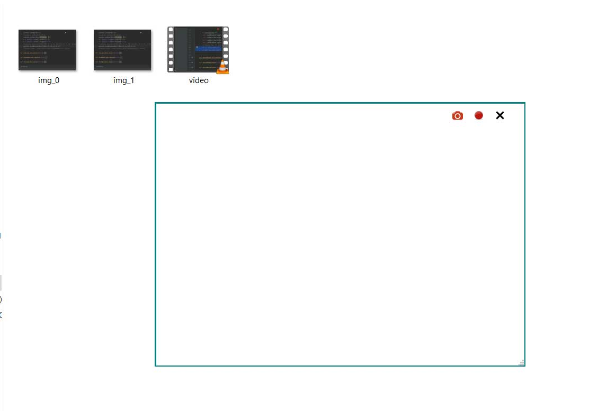

# ScreenCapture
Screen recording widget. You can take multiple screenshots or capture video in mp4 format.

# Install
git clone https://github.com/DmoFX/ScreenCapture.git   
python main.py

# Libraries.
App requires PySide2(PyQt5 works too), numpy, cv2, PIL, pyautogui, mss is added as an option.
